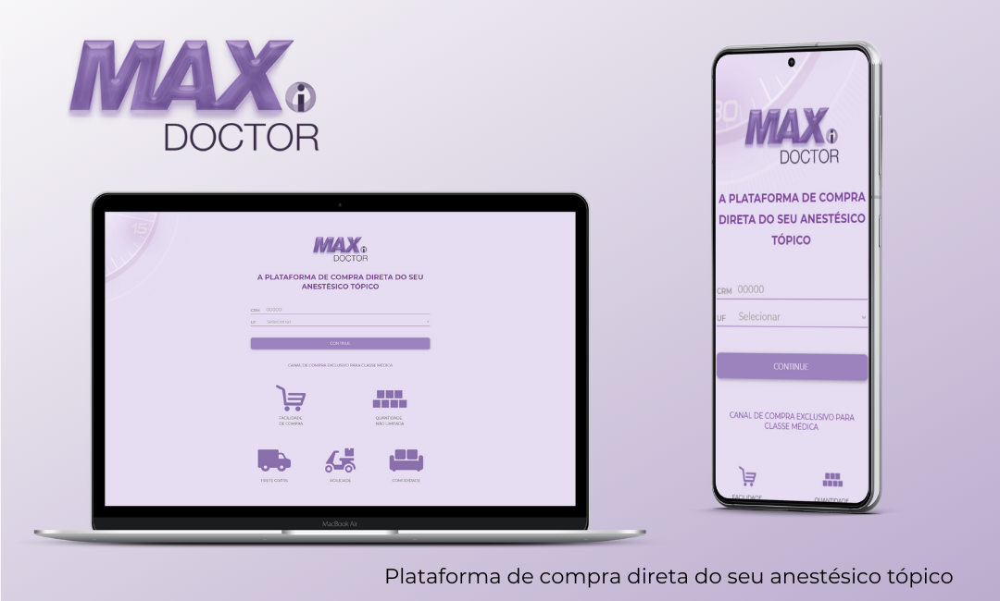

# Avaliação Huia - MaxDoctor

Aplicação web desenvolvida com a finalidade de realizar uma validação básica de CRM e UF ao submeter um formulário.

### :woman_technologist: Tecnologias utilizadas no desenvolvimento:
- HTML
- CSS
- JavaScript
- JQuery

### :computer: Como rodar no local:
- Baixe o projeto
- Acesse o arquivo index.html localmente pelo navegador ou abra a pasta do projeto pelo Live Server (extensão do VSCode) - ou algum servidor local.